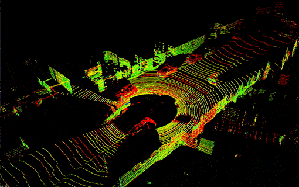
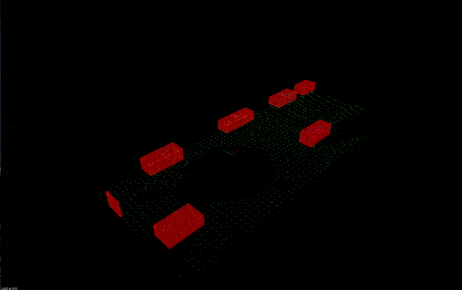

# Lidar Obstacle Detection
Implementation of Lidar introduction project from Udacity SFND.

This project contains code that demonstrates techniques of working
with the point cloud data collected with the Lidar sensor.
The code utilizes the PCL library.

- The RANSAC algorithm is used to separate  road plane and obstacles.
- The obstacle detection is done with help of Euclidean clustering algorithm, which uses a k-d tree to increase speed of the search of points in the point cloud.

### Initial point clouds representation

### Processed point clouds


### Build
```
$> mkdir build
$> cd build
$> cmake .. && make
$> ./environment
```